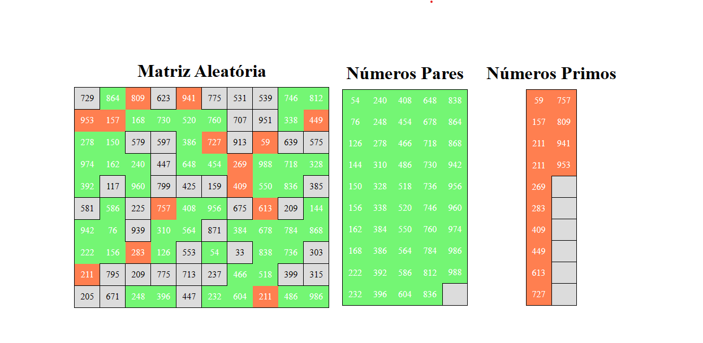

# Matrix Manipulation Web App

This repository contains a matrix manipulation web application developed for a college assignment. The program generates a random matrix of 100 elements, displays it, colors the even numbers in green, the prime numbers in red, and creates two additional matrices based on these criteria.




## Features

- Random Matrix Generation
- Display Matrix
- Color Even Numbers in Green
- Color Prime Numbers in Red
- Generate Additional Matrices based on Criteria

## Technologies Used

- HTML
- JavaScript
- CSS

## Getting Started

To run the web application locally, follow these steps:

1. Clone the repository:

   ```bash
   git clone https://github.com/your-username/matrix-manipulation-web.git
